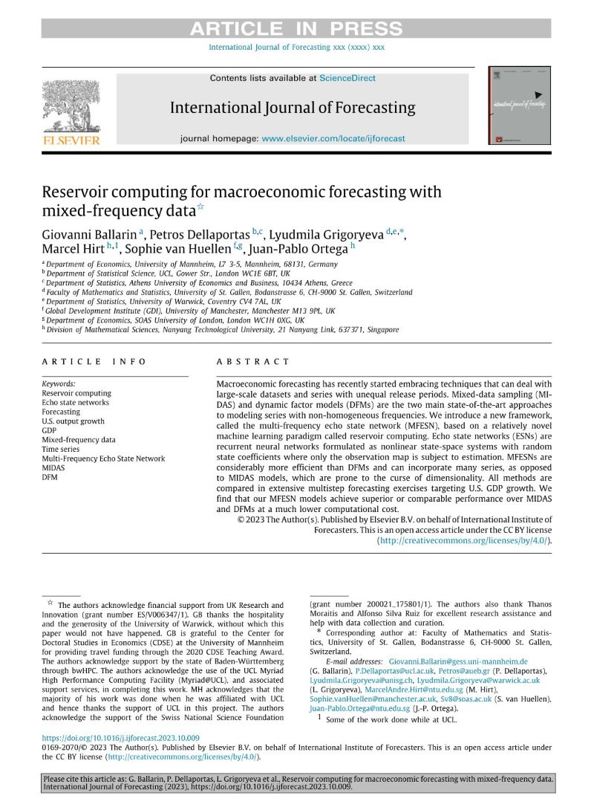

# Reservoir Computing for Macroeconomic Forecasting with Mixed Frequency Data

Repository for the UKRI funded project **Reservoir Computing for Macroeconomic Modelling**, Ref: ES/V006347/1.

Project structure:

* `python`: model code; MIDAS and multi-frequency ESN model libraries; DFM model scripts; Jupyter notebooks with estimation, forecasting and simulations.

* `R`: data clearning; model forecast restructuring and statistical tests (MCS etc).

* `figures`: all exported figures used in the paper.

Wherever possible, raw data is also included in the `data` folder. For details regarding data copyrights and sources, please refer to `data/info.txt`.

## Reference

Published version (Open Access): [DOI](https://doi.org/10.1016/j.ijforecast.2023.10.009)

Working paper versions: [ArXiv](https://arxiv.org/abs/2211.00363), [ResearchGate](https://www.researchgate.net/publication/364957371_Reservoir_Computing_for_Macroeconomic_Forecasting_with_Mixed_Frequency_Data)



Citation:

```bibtex
@article{BALLARIN2023,
  title = {Reservoir computing for macroeconomic forecasting with mixed-frequency data},
  journal = {International Journal of Forecasting},
  year = {2023},
  issn = {0169-2070},
  doi = {https://doi.org/10.1016/j.ijforecast.2023.10.009},
  url = {https://www.sciencedirect.com/science/article/pii/S0169207023001085},
  author = {Giovanni Ballarin and Petros Dellaportas and Lyudmila Grigoryeva and Marcel Hirt and Sophie {van Huellen} and Juan-Pablo Ortega},
}
```
